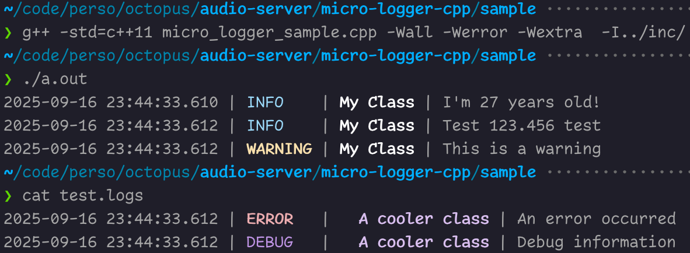

# micro-logger-cpp

Small header-only C++ logging library using streams.
A logger instance can be created from a `std::ostream&` (a file; `cout`; etc.) and a tag (e.g. your class' name).

Kept the interface minimalist (e.g. no way to change the formatting for `Logger`'s interface): found it easier to simply update the code to suits the needs of whichever project I'm working on.

