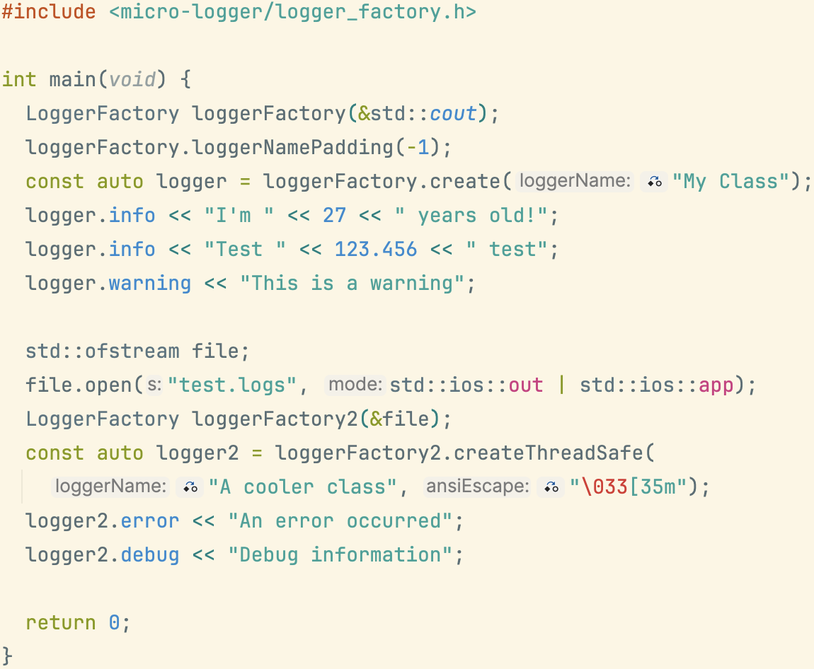

# micro-logger-cpp

Small header-only C++ logging library using streams.
A logger instance can be created from a `std::ostream&` (a file; `cout`; etc.) and a tag (e.g. your class' name).

Kept the interface minimalist (e.g. no way to change the formatting for `Logger`'s interface): found it easier to simply update the code to suits the needs of whichever project I'm working on.




## Platform Support

- **Linux**: ✅ Fully supported (native build)
- **macOS**: ✅ Fully supported (native build)
- **Windows**: ✅ Supported via cross-compilation from Linux/macOS

### Windows Cross-Compilation

micro-logger-cpp can be cross-compiled for Windows using mingw-w64. The library uses C++11 threading features (`std::mutex`), which requires the **POSIX threading model** variant of mingw-w64.

**Quick Start (Docker):**
```bash
cd cross-compile
./cross-compile-windows.sh
```

**Test with Wine:**
```bash
cd cross-compile
./test-windows-with-wine.sh
```

**Output:**
- Windows executable: `cross-compile/build-windows/micro_logger_sample.exe`

**Requirements:**
- Docker (for containerized cross-compilation)
- OR mingw-w64 with POSIX threading model installed locally

**Important:** The default mingw-w64 uses the win32 threading model, which does NOT support C++11 threading. You must use the POSIX variant:
```bash
# Ubuntu/Debian: Install POSIX variant
apt-get install g++-mingw-w64-x86-64-posix

# Compiler names:
x86_64-w64-mingw32-g++-posix   # ✅ Correct (supports std::mutex)
x86_64-w64-mingw32-g++         # ❌ May not support std::mutex (win32 threading)
```

For detailed information about the threading model issue and complete investigation notes, see:
- [`cross-compile/README.md`](cross-compile/README.md) - Build instructions
- [`WINDOWS_CROSS_COMPILATION_NOTES.md`](WINDOWS_CROSS_COMPILATION_NOTES.md) - Technical deep-dive